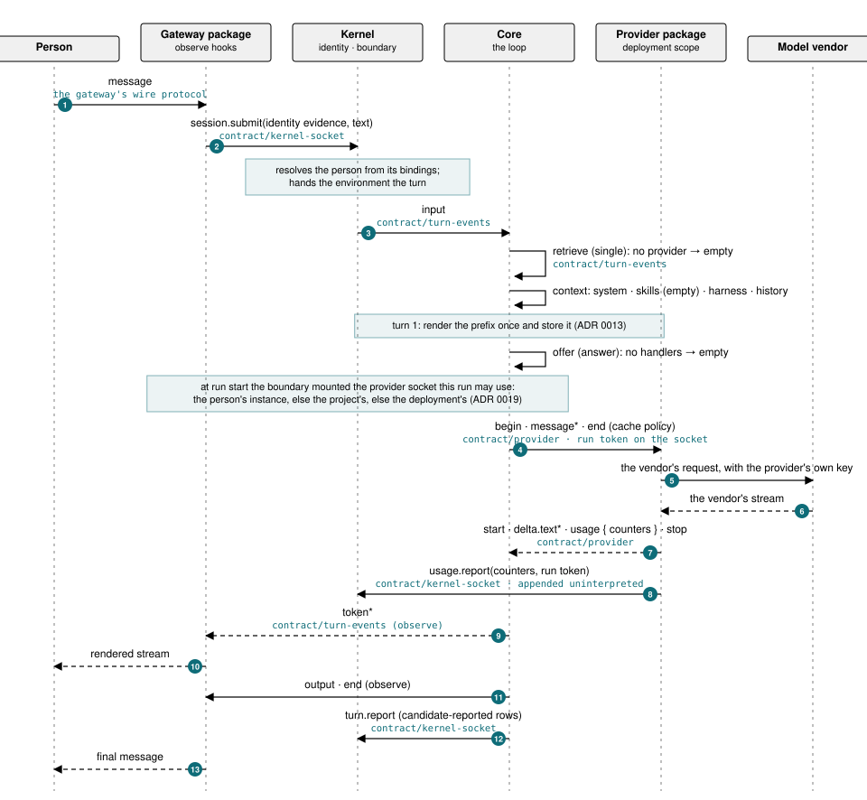
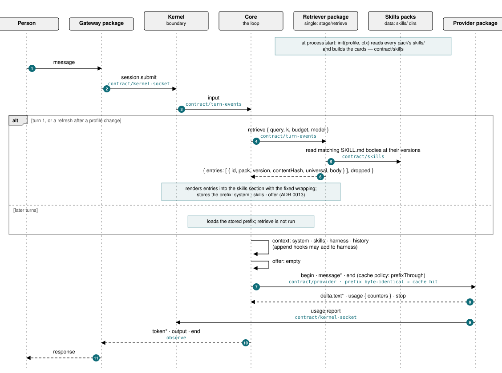
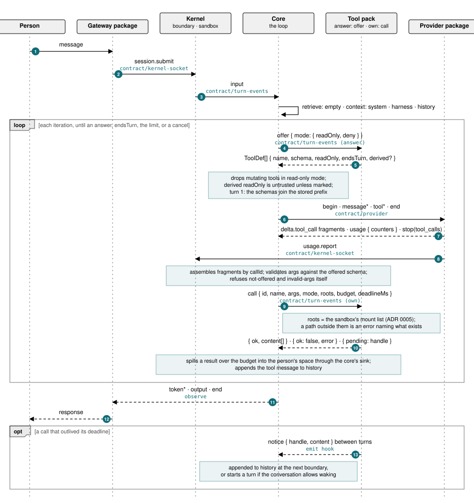

# 00 · The proposal

Eighth draft, 2026-09-09. Three critics argued over the sixth draft and
then answered each other; two design exercises and an outside review by
Codex ([review/debate.md](review/debate.md)) corrected the seventh. Simplified Technical English. Reasons are in
[05-successor.md](05-successor.md). What is carried from Thetis is in
[07-keep.md](07-keep.md); what is taken from PrimeAgent is in
[10-prime-agent.md](10-prime-agent.md).

One rule shapes everything: **the core and the kernel name no package, no
service, and no vendor.** A package declares what it requires. Another
package, or the kernel, provides it. The kernel matches names. If a name is
not provided, the kernel says so in one sentence.

## 0. The flow

Three sequence diagrams (SVG, generated by `flow/gen.py`) show one turn
from request to response. Each
hop names the contract that governs it. Each stage names its hook type
(ADR 0015 §6). The pipeline is the same in all three; a profile only
changes which packages answer.

### 0.1 Base: no skills pack, no tool pack



The base turn has one model call and no iteration. The kernel observes
usage and the exit; the core reports its stage rows; only the observed
facts gate anything (ADR 0014).

### 0.2 Skills only



Skills cost nothing after turn 1: the prefix is stored, the provider's
cache holds it, and the retriever is idle until a profile change.

### 0.3 Tools only



Tools add iterations. Each one repeats offer, model, and call inside
the same turn; the core is the only thing that validates arguments,
enforces read-only mode, refuses a tool it did not offer, and spills.

## 1. The loop

The core of the system is one loop: input → agent → response → repeat.

The loop is the only fixed part. It is one package, `core`, of about 600
lines. A turn is a stream of events. A stage can leave a notice between
turns; the core appends it to the history at the next turn, or starts a
turn for it if the conversation allows. Each event has one hook type:
observe, append, answer, own, single, or emit, and any stage may observe
any event read-only. A stage cannot rewrite another's work. The core runs the stream through the
stages in the profile, in order, and each stage can read an event, change
it, or add events after it. The core defines the event names and their
shape. It defines nothing else. It knows no package by name. It declares
its own needs like any package: `requires: { stage/retrieve: "^1" }`.

## 2. Packages and stages

Everything else is a package: a directory with `package.json` and
`index.ts`. A package exports `stages`, functions on the turn stream;
`skills`, a directory of skill files; and `spawn`, services (chunk 8).
There are no other kinds. A stage module may export `init(profile, ctx)`
and `shutdown()`. A package declares its own settings under `settings`
as a schema the kernel checks before `init`; a setting of kind `secret`
is a reference the kernel resolves. At `init` a package may register
concrete requirements, provisions, and spawns computed from its
settings, inside an `envelope` its `package.json` declares; review sees
the envelope, install sees the concrete set, and a registration outside
it is refused. One MCP package with a list of servers is one package.
A package with no exports is a library.

The events of a turn:

| Event | Carries | A stage that handles it is, by role, |
| --- | --- | --- |
| `input` | a person's message and attachments | a gateway |
| `retrieve` | the query, a budget, and the model; answered with skill entries, with or without bodies; runs on turn 1 and on a refresh | a skills runtime; the only singleton |
| `context` | named sections in a fixed order: `system`, `skills`, `harness`, `history`; a stage appends to a section | the harness notes, compaction |
| `offer` | the tools offered; each with schema, `readOnly`, `endsTurn` | a tool pack |
| `call` | one tool call with the mode, the roots, and a budget; answered with typed content or an error, or `pending` for work that outlives the deadline | a tool pack |
| `notice` | a stage's message between turns | a tool pack with background work, the harness refine |
| `model` | the normalized request as sent and every response event as received | a gateway, a trace package (observe) |
| `token`, `output` | the stream and the reply | a gateway, the turn log |
| `end` | how the turn ended | a gateway, the harness refine |

"Tool", "skills pack", "gateway", and "runtime" are roles, not kinds. A
tool is a stage that answers `offer` and `call`. A skills pack is data:
a `skills/` directory in the Agent Skills format, `provides:
skills/<pack>`, with ids unique across the profile. A runtime replaces
the default for a singleton event by providing its name; `provides:
{ stage/retrieve: "1.0.0" }` is a singleton, so a swap is a swap. Other
events are handled by any number of stages in profile order. The core
renders the `retrieve` answer into the `skills` section itself. A
gateway is the stage at both ends of the stream, and it also has a
mount, an identity check, and assets (chunk 8).

The core keeps one piece of knowledge about roles: it filters `offer` in a
read-only mode and refuses `call` for a tool it did not offer. A tool
whose definition is derived from data or a remote server is treated as
mutating unless its source is marked trusted. The core spills any result
over a setting into the person's space. The rest of
the tool contract is the shape of the `offer` event. The default profile
has `retriever-local`, the ranker Thetis benchmarked, as the stage that
answers `retrieve`.

## 3. Requirements

A package declares what it needs and what it supplies. Both are maps of
names in one namespace. The kernel matches strings and checks ranges with
semantic versioning. It does not know what any name means.

```
requires: { search: "^0.2", service/vector-store: ">=1.9", setting/index_dir: "*", secret/api_key: "*", cap/gpu: "*", core: "^1" }
provides: { stage/retrieve: "1.0.0", service/vector-store: "1.9.0", mount//play: "1.0.0" }
```

| Prefix | Provided by |
| --- | --- |
| none | a package version in a registry |
| `service/` | a package whose `spawn` runs it, or a setting that names an address |
| `stage/` | a package whose stage answers that event, replacing the default |
| `mount/` | a gateway |
| `setting/` | the environment's settings file |
| `secret/` | the kernel only, from its encrypted store, at scope `person`, `project`, or `deployment`, first match in that order for the caller; delivered to a spawned process as an environment variable, never written to disk; a `deployment` service gets `deployment` secrets only |
| `cap/` | the kernel, which reports what the machine has |
| `contract/` | a contract package: the types, a JSON schema per message, and a conformance test; no implementation. `contract/turn-events` (from `core`), `contract/skills`, `contract/provider`, `contract/kernel-socket` (from the kernel) exist from milestone A |

Scope is part of the match: a `deployment` requirer needs a `deployment`
provider. A provided name is a singleton per profile; two providers refuse
the install. Cycles are refused by name. Role permissions are not
requirements; they are `auth`.

A provider and a requirer of `service/<name>` both require
`contract/<name>`. The contract's conformance test runs against the
provider at publish. Every message carries the contract version it was
written to; readers ignore unknown fields; writers never remove a field
without a major. A service provides one major; a default that would strand a profile on
an old major is refused by name. The turn events are `contract/turn-events`, shipped by
`core`; the kernel socket is `contract/kernel-socket`, shipped by the kernel.
See [ADR 0006](adr/0006-contracts-are-packages.md).

The kernel matches when a package is linked under `work/`, when a profile is
installed, when a release is reviewed, and again at `init` for names a
package registers from its settings, which must fall inside its declared
envelope. Every gap is one sentence of
one shape: *`X 1.2.0` requires `service/vector-store >=1.9`. Nothing in
this profile provides it. `vectors-server 0.4.0` in the company registry
does.* The last clause is one `ls-remote` per registry, cached.

## 4. Versions and releases

A change is a new version of a package. A fix is a patch version. An
improvement is a minor version. A break is a major version. The kernel
computes the smallest bump the `offer` schemas, the contract schemas,
and `provides` allow. The
agent can go higher, never lower.

A change that spans packages is a **release**: a set of versions with one
name and one note, reviewed as one diff, made default as one act or not
at all. One version is a release of one.

Versions are immutable. Undo is a return to the previous version.

## 5. Registries

The marketplace is a list of git URLs in the kernel configuration. Each is a
**registry**: a repository of packages with a tag per version. The kernel
fetches one commit at a time, with no submodules, hooks, or scripts, and
keys the package by commit hash. The first registry is the deployment's
own bare repository and the publish target. Two deployments share packages
by exchanging a URL.

The list is the only allowed source. The default profile pins by commit
hash and the kernel refuses a mismatch. A package may require only packages
from the list; a publish with an external dependency is refused. A library
from outside enters a registry once, as a vendored package, through
review. The `package.json` format and semantic versioning are used. The
npm registry and client are not.

## 6. Environments and profiles

Each person has one environment: a directory with a `package.json`, the
profile, and one process that runs from it. The kernel starts that process
in a sandbox (chunk 10). Inside it, only the environment directory, the
person's spaces, and the registry cache exist. The profile starts as a copy
of the default profile. A package the person's agent edits is a directory
under `work/`, referenced as `file:work/<name>`.

All conversations of a person run on the person's profile. A change in one
conversation is present in the next message of every other. Nothing
reaches another person until a reviewer makes a version the default.

The environment holds three more things. `state/<package>/` is package
state, by name, not by version; a version that changes its format ships a
migration. `harness/` holds the person's notes, memories, and briefs; the
loop edits them at turn end with an evidence string and can roll them
back; they enter the `harness` section, after the pinned prefix.
`conversations/*.jsonl` is append-only; compaction, branches, and fresh
conversations are views of it. The core writes the pinned set into it
after the first turn. Every sandbox sees the registry cache read-only
at `/packages/<name>@<version>/`.

## 7. Spaces and artifacts

A space is a directory agents work in.

| Space | Who reads | Who writes |
| --- | --- | --- |
| `spaces/company/` | everyone | roles the policy names |
| `spaces/projects/<name>/` | the members | the members |
| `spaces/people/<user>/` | the person | the person |

A project has a name, members, and a policy. A conversation can be
attached to a project. The sandbox mounts the person's space, the spaces
of their projects, and the company space, each with its mode. Nothing
else exists inside the sandbox. The file tools are a convenience with
good error messages; the mount list is the boundary. A shared space is
shared by design; the kernel snapshots spaces on a schedule and at every
default change, so damage is recoverable.

An **artifact** is a file an agent made for a person. It is a file in a
space and a record in the conversation with path, hash, author, and time.
A gateway serves it after the identity check. An attachment a person
sends is an artifact the person made.

## 8. Gateways and services

A **gateway** is the stream boundary facing people; a **provider** is
the stream boundary facing models. Both are packages behind a contract.
A provider holds its own key as a secret delivered at start; a person
on their own key runs their own provider instance at person scope. A
provider emits usage as named counters; a budget is an administrator's
rule over a counter name.

A **gateway** is a surface people talk through: a stage that emits
`input` and consumes `output`, with three more fields because it faces
the network: `mount`, `identity(request)`, and `assets`. The kernel gives it
one session API, scoped to the person `identity` returns: list, create,
submit, subscribe, cancel. It cannot name another person's conversation.
The web UI, Discord, and the campaign are gateways.

A **service** is a process a package runs. `spawn` is a list of entries
with `id`, `cmd`, `args`, `env`, `health`, `restart`, `scope`, and its
own `network`, within what the package requires. `health` is a URL, a
command, or an RPC ping. The
supervisor probes health, restarts with back-off, and keeps a process that
dies in its first seconds down, loudly. Output goes to the environment's
log.

Both have a scope. `person` runs inside the person's sandbox and listens
on a unix socket in the environment directory, never on a port: the web
UI, a browser for the web tools. `deployment` runs once, from the default
profile, in its own sandbox with no person: Discord, `/play`, a model
provider adapter, a shared model server. Only a `deployment` process with a `mount/` or `service/`
provision binds a port, and the kernel exposes it. A person tries either
scope in their own environment first. At make-default, a `deployment`
process is switched by start, probe, switch, stop. One that then dies
repeatedly is replaced by the previous default, and the incident is
written to the metrics page.

## 9. Publish, review, make default

1. **Work.** The agent puts a package under `work/` when asked for a
   change.
2. **Try.** The environment restarts at the next turn boundary. The change
   runs.
3. **Publish.** The agent sets the version and the note and publishes the
   release to the deployment's registry. The kernel runs the checks: the
   type checker, the package's tests, the tests of every default package
   that requires it, the smoke check, and the suite.
4. **Review.** A reviewer opens the release: diff, note, checks, scores,
   unmet requirements, and who already runs it. Two buttons: **Make
   default** and **Send back**. Send back writes a note into the
   publisher's environment.
5. **Make default.** The pins move. Every environment is offered the
   update. The kernel snapshots `state/` first and keeps it seven days.
6. **Undo.** The pins return.

The review page is part of the web UI package; the act is the kernel's. No
automatic make-default in the first version.

## 10. The kernel

The one trusted process. People edit it with a pull request. The loop does
not. It keeps only what cannot be delegated without losing a guarantee;
everything else is a package that reaches authority through a kernel
call ([ADR 0017](adr/0017-the-kernel.md), [0018](adr/0018-identity-and-the-act.md),
[0019](adr/0019-no-door.md)). About 1,300 lines. TypeScript,
like everything else; the type checker is the gate; there is no build
step, no WebAssembly, no Rust. Targets: under 120 MB with one idle
environment; under one second from edit to serving, sandbox start
included.

| Part | Function |
| --- | --- |
| `identity` | principals; bindings from an external kind and id to a principal; the roles `admin`, `reviewer`, `user` and their policy, including whether a role may observe another person's conversations; the designated authentication authorities; session and run tokens. Login itself is a gateway's job |
| `boundary` | the kernel socket and per-run tokens as inherited file descriptors; the sandbox runner interface and its one adapter, `bwrap`; which service sockets a run sees, by scope (the person's provider instance, else the project's, else the deployment's); budgets as rules over the reserved `cost` counter, handed to deployment-scope providers at start and enforced by them at the call; every storage pool bounded |
| `secrets` | the store, resolution by scope (person, then project, then deployment, never falling through), delivery only to a registered spawn at start; a gateway's form posts a value straight to the kernel's origin |
| `generations` | install by pinned hash; snapshot with writers stopped; the act: `default.set(digest, baseline)` by compare-and-swap after the gate and evidence-identity check, confirmed by a code the kernel shows on one line at its own origin; start, probe, switch, drain, stop; restore on failure; the same transaction for the kernel's own upgrade |

Delegated to packages at deployment scope: the login gateway (the
authority for the `password` kind; other kinds are other gateways),
the review page, status and reset for a broken environment,
`registries` (fetch, resolve, publish, search; the kernel verifies every
hash before extraction), `cli`, `snapshots` (retention and pruning),
`metrics` (the log query and page), the `evaluator`, providers,
retrievers.

If a person's environment fails its health probe, the kernel restores
the last healthy generation of their profile, keeps `work/` for repair,
and writes the error into the conversation. Status, logs, and reset are
kernel calls, served by a deployment-scope gateway that does not need
the person's environment to start.

## 11. Measurement

The kernel writes one JSON line per turn, in two labelled parts. What the
kernel observed or reviewed code reported: a deployment-scope provider's
usage counters, sandbox events, exits, the evaluator's outcome checks. What the candidate reported: the stage rows, the
retrieved ids, the tools offered, each call's validity and duration.
Only observed facts gate anything; reported rows diagnose.

Every benchmark runs paired: the default profile and the candidate, on
the same model, tasks, and seeds. The review page shows the delta and its
interval, never an absolute score. A benchmark is a package: a stage that
feeds tasks as `input` and a scorer that reads `end`. ToolRet and
SkillRet run offline at publish. BFCL, τ-bench, a coding sample, and an
MCP benchmark run on a schedule. The private suite stays in the kernel and
scores skills, compaction, and harness tasks.

Nothing under review scores itself, sees its scorer, or can enumerate
the hidden tasks or read their expected answers. No model judges
anything. The suite, seeds, and scorers are the assets of an evaluator
package at deployment scope, in its own sandbox, that no environment
can mount; the kernel runs no evaluation code and verifies a result's
identities before it counts. Checks run on the published commit in a
clean kernel environment. Each task runs as a seeded mutation of itself.
A scorer change is its own release, scored by replay.

The review page shows three numbers: `suite_lift` with its interval,
`suite_cost`, and `regressions`, and below them only the rows that
moved: `tool_lift`, `skill_lift`, `offer_f1`, `invariance`. A release
becomes default only if the checks pass, the lower bound of `suite_lift`
is above a margin declared before the run, deterministic regressions
are zero, and a person pressed the kernel's button. "Improved" is said
only when the whole interval is above zero. [06-metrics.md](06-metrics.md) and
[ADR 0004](adr/0004-idempotent-tamper-resistant-measurement.md) have the
design.

## 12. Build order

| Milestone | Done when |
| --- | --- |
| A | Two accounts chat in their own environments through the lifted web UI, through `provider-openai-compatible` and the mock provider, with the file tools over the three spaces and `retriever-local` as the `retrieve` stage; turn two reports a 99% cache hit |
| B | A low-access account publishes a search bar for the context panel; a package that requires an unprovided service is refused with the one-sentence gap, then accepted with its provider; the administrator presses one button and wrote nothing; a stage that injects a memorised answer fails the mutated task |

The campaign and Discord are the first customers, not milestones.

## 13. Rules

If a change breaks one of these, the change is wrong.

1. The core and the kernel name no package, service, or vendor. The core
   defines events; packages define stages.
2. The registry list is the only source; pins are commit hashes.
3. A published package with an external dependency is refused.
4. A provided name is a singleton per profile.
5. A `secret/` never reaches an environment's disk or process. A person
   sets their own through the kernel, never through the agent, and a
   failed key fails the turn rather than falling through.
6. Every environment, gateway, and service runs in a sandbox; the mount
   list is the boundary; nothing selectable by a profile can widen it.
7. The prefix (`system`, `skills`, the `offer` schemas) is rendered
   once per conversation and stored; it changes only at an announced
   profile change, which costs one cache miss and one line in the
   conversation; the prefix is outside compaction.
8. State is kept by package name; a format change ships a migration.
9. A tool no longer offered is refused with the name of its replacement,
   and a profile change writes one line into the conversation naming the
   tool and skills packs that changed.
10. The turn log is written by the kernel only; what the kernel observed and
    what the candidate reported are labelled, and only the former gates.
11. Nothing under review scores itself, sees its scorer, or sees its
    tasks; no model judges anything.
12. Every message, on every contract, tolerates unknown fields; a
    contract's version is negotiated once per connection; a change is
    compatible, capability-gated, or incompatible, and the kernel socket
    is tested in both directions.
13. The default moves only by a reviewer's act; a conflict lands in the
    publisher's environment.
14. A never-default version is hidden after 30 days and deleted unless a
    profile or a live conversation pins it.
